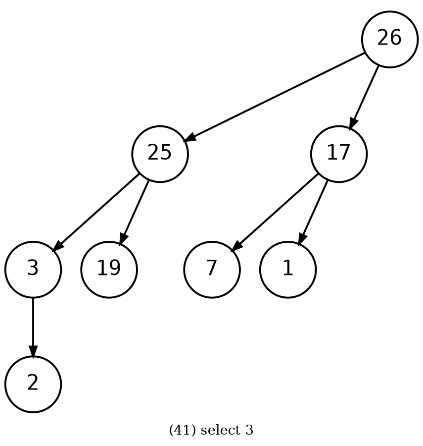
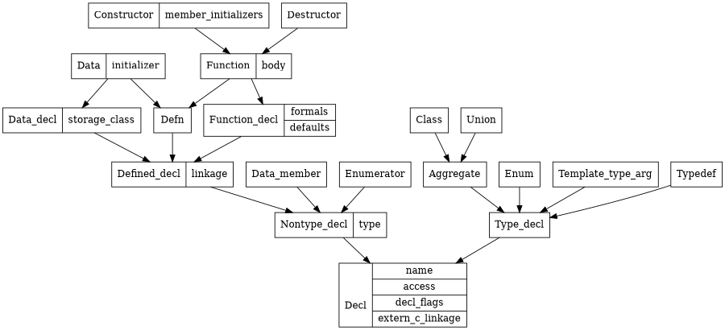
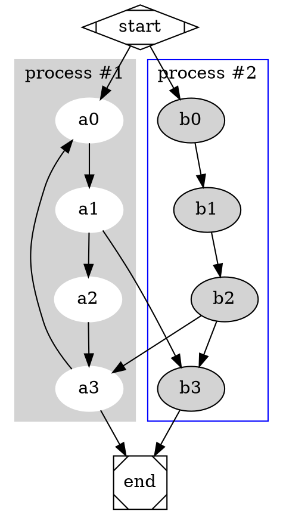
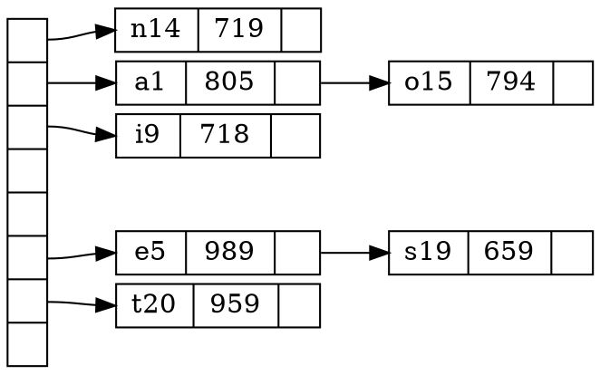

# dot
## [1.dot](https://github.com/luzhixing12345/syntaxlight/tree/main/test/dot/1.dot)

## [2.dot](https://github.com/luzhixing12345/syntaxlight/tree/main/test/dot/2.dot)

```dot
digraph astgraph {
  node [shape=circle, fontsize=12, fontname="Courier", height=.1];
  ranksep=.3;
  edge [arrowsize=.5]
  node1 [label="+"]
}
```

## [3.dot](https://github.com/luzhixing12345/syntaxlight/tree/main/test/dot/3.dot)

## [4.dot](https://github.com/luzhixing12345/syntaxlight/tree/main/test/dot/4.dot)

```dot
digraph g {
	rankdir=LR;

	node [shape=rpromoter colorscheme=rdbu5 color=1 style=filled fontcolor=3]; Hef1a; TRE; UAS; Hef1aLacOid;
	Hef1aLacOid [label="Hef1a-LacOid"];
	node [shape=rarrow colorscheme=rdbu5 color=5 style=filled fontcolor=3]; Gal4VP16; LacI; rtTA3; DeltamCherry;
	Gal4VP16 [label="Gal4-VP16"];	
	product [shape=oval style=filled colorscheme=rdbu5 color=2 label=""];
	repression [shape=oval label="LacI repression" fontcolor=black style=dotted];
	node [shape=oval style=filled colorscheme=rdbu5 color=4 fontcolor=5];
	combination [label="rtTA3 + Doxycycline"];
	LacIprotein [label="LacI"];
	rtTA3protein [label="rtTA3"];
	Gal4VP16protein [label="Gal4-VP16"];
	

	subgraph cluster_0 {
		colorscheme=rdbu5;
		color=3;
		node [colorscheme=rdbu5 fontcolor=3];
		Hef1a -> Gal4VP16 [arrowhead=none];
		Gal4VP16 -> UAS [arrowhead=none];
		UAS -> LacI [arrowhead=none];
		LacI -> Hef1aLacOid [arrowhead=none];
		Hef1aLacOid -> rtTA3 [arrowhead=none];
		rtTA3 -> TRE [arrowhead=none];
		TRE -> DeltamCherry [arrowhead=none]
	}
	
	Gal4VP16 -> Gal4VP16protein;
	Gal4VP16protein -> UAS;
	LacI -> LacIprotein;
	LacIprotein -> repression;
	repression -> Hef1aLacOid [arrowhead=tee];
	IPTG -> repression [arrowhead=tee];
	rtTA3 -> rtTA3protein;
	rtTA3protein -> combination;
	combination -> TRE;
	Doxycycline -> combination;
	DeltamCherry -> product;
	
	
		
}

```

## [5.dot](https://github.com/luzhixing12345/syntaxlight/tree/main/test/dot/5.dot)

## [6.dot](https://github.com/luzhixing12345/syntaxlight/tree/main/test/dot/6.dot)

